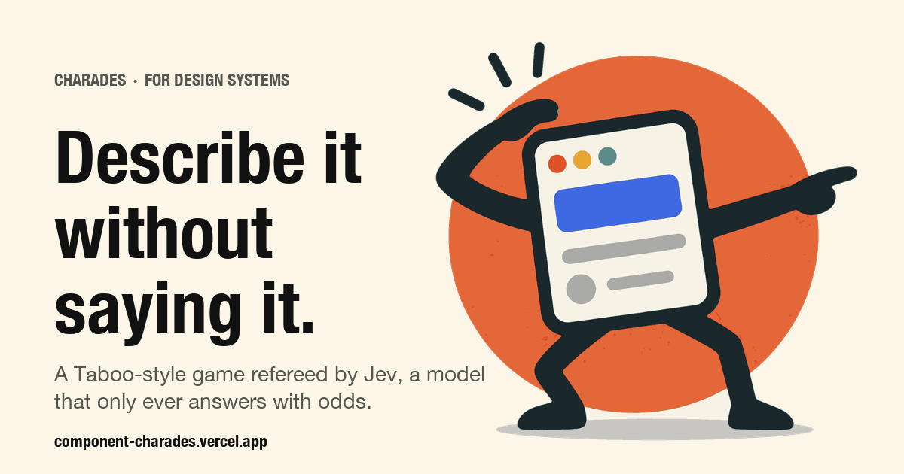

<p align="center">
  
</p>

# Component Charades

**It's Taboo for design systems, and the other player is a model that can't talk.**

You're dealt a UI component. Toast, say. You have to get Jev to guess it without using the word "toast", or "snackbar", or "notification", or any of the other words on the card. As you type, Jev re-ranks all 135 components in the library and puts odds on every single one. When it's sure enough, it buzzes. Fewer words, better score.

Ambiguity is the comedy. Watch Toast, Snackbar, and Banner fight over the probability mass. Watch "a small message" split 80/12. Watch one word ("corner") end the argument.

**▶ Play it: [component-charades.vercel.app](https://component-charades.vercel.app)**

## How to play

1. **You get a card.** The component's name, its category, and a list of words you may not say. Jev can't see any of this.
2. **Describe it.** What it does, how it looks, where it lives. Every 350ms of quiet, one request goes out and the odds board redraws.
3. **Get buzzed.** Below 0.5 confidence Jev is "listening". Between 0.5 and 0.85 it's "leaning". At 0.85 it commits, right or wrong. Your score is how few words that took.

There's a second mode, **Find a component**, where you describe a job ("submits a form", "tells me someone else is typing") and Jev tells you which component does it, how sure it is, and, separately, whether the library has anything for it at all. If it doesn't, you get to name the thing that should exist.

## Wait, what is Jev?

Jev is [TypeSafe AI](https://typesafe.ai)'s model. It is not a chatbot. It cannot write a sentence, and it never will in this app. Every word of copy you see was typed by a person.

What Jev does is take some text (your description) and a set of typed questions, and return **numbers**: which option out of 136 fits best and how the probability spreads across all of them; whether a yes/no statement holds, as a probability; where something lands on a rubric you wrote. One request, every question evaluated in parallel, 150–400ms, about $0.0002. TypeSafe calls this a System One model, after Kahneman's fast intuitive thinking, and trains it for calibrated probabilities rather than pleasing prose.

That's exactly the shape of a guessing game. The odds board *is* Jev's output. The buzz-in *is* a threshold on Jev's confidence. Nothing is dressed up.

The longer, more careful version is in [WRITEUP.md](WRITEUP.md), including what Jev is bad at and why we kept all of that in ordinary code.

## The page is the request

The interface borrows the look of TypeSafe's developer console on purpose. The console draws each primitive as a schematic card: `INSTRUCTIONS`, `OUTPUT`, `DISTRIBUTION`. This game is literally one Jev request per keystroke, so the page is drawn the same way.

- The panel you type into is labeled `STATE`, because that's the field it becomes.
- The odds board is `CHOICE · which_component` with a real distribution, sorted by `p`.
- `CONFIDENCE` has its own readout with tick marks at the two thresholds.
- The side questions (`describes_behavior`, `describes_appearance`, `describes_placement`, `is_vague`, `vividness`) show as little instruments. They're asked speculatively on every request because adding questions costs almost nothing, and they power the "mostly the placement gave it away" line at the end of a round.

You learn the API by playing.

## Does it actually work?

We wrote 40 descriptions the way people really type them ("little popup that says saved and goes away", "red dot with a 3 on the bell icon", "are you sure you want to delete this") and checked where the intended component ranked.

| Question set | Top-1 | Top-3 |
| --- | --- | --- |
| Charades | 36 / 40 | 39 / 40 |
| Finder | 37 / 40 | 38 / 40 |

The misses are arguments, not errors: "agree to the terms" → Button over Checkbox; "turn dark mode on" → Theme Toggle over Switch, which is probably the better answer; "switch between overview and reviews" → Segmented Control 0.52 vs Tabs 0.47, which the confidence value correctly flags as a coin flip.

Run it yourself with `npm run eval` (needs a key; costs about a cent). Add a case whenever something feels off. The cases live in [`scripts/eval.ts`](scripts/eval.ts).

## Run it locally

```bash
npm install
cp .env.example .env.local     # paste your TypeSafe key from console.typesafe.ai
npm run dev
```

No key? It still runs. Without `TYPESAFE_API_KEY` (or with `JEV_MODE=fixtures`) the app uses a dumb keyword-overlap stand-in so you can work on the UI at zero cost. The usage strip at the bottom says `source: fixtures` so you can never mistake it for the real thing.

## Where the interesting code is

Two files are worth reading. Everything else is plumbing.

- [`src/lib/jev/questions.ts`](src/lib/jev/questions.ts): every question Jev is asked, every option and rubric, every threshold. If you want to change how the game feels, change this file. `BUZZ_IN = 0.85`, `LEANING = 0.5`, `TOSS_UP = 0.25`.
- [`src/lib/game/verdict.ts`](src/lib/game/verdict.ts): turns Jev's numbers into `listening` / `leaning` / `buzzed` / `vague` / `not_a_component`. Jev never decides to buzz. This code does, using the number Jev returned.

The rest:

| Path | What it does |
| --- | --- |
| `src/data/components.json` | 135 components with `name`, `aliases` (the banned words), `category`, and a one-line `description` that becomes the Choice option Jev sees |
| `src/lib/catalog.ts` | lookups, banned-word derivation, the local banned-word check with plural stemming |
| `src/lib/jev/evaluate.ts` | calls Jev (or fixtures) and normalises the answer |
| `src/lib/game/round.ts` | HMAC-signed round tokens so the browser can't forge a win |
| `src/app/api/round/route.ts`, `src/app/api/guess/route.ts` | the two endpoints; banned words are re-checked server-side |
| `src/hooks/*` | debounce, abort in-flight requests, phase transitions, scoring |
| `src/components/*` | the console-style cards |

The API key is only ever read in route handlers. It never reaches the browser.

## Things we learned the hard way

**Wording is the tuning knob.** The Finder started out asking the same question as Charades and kept picking the *container* an action lives in: "submits a form" gave Form 32%, "closes the dialog" gave Modal 49%. One extra sentence in the Finder's instructions ("choose the element that performs the action, not the form or dialog around it") moved both to Button at 99% and 94%. No thresholds touched. TypeSafe documents this as Jev's literal reading. It is real.

**Show people their card.** An early version told you the category and letter count and expected you to infer the component from the banned words. Everyone typed whatever they wanted, got "wrong buzz", and had no idea why. Now the name is the first thing on the screen.

**Jev is decisive.** Once a description has a behavior or a placement, it usually jumps straight to 1.00. "a small message" gives Toast 0.80 / Snackbar 0.12; add "in the corner" and it's over. The whole game happens in the first six words, which is why the score is word count.

## Add a component

Append to [`src/data/components.json`](src/data/components.json):

```json
{
  "id": "typing_indicator",
  "name": "Typing Indicator",
  "aliases": ["typing dots", "is typing", "three dots"],
  "category": "feedback",
  "description": "Three small bouncing dots in a chat that show the other person is writing a reply."
}
```

That's it. The Choice grows by one option. The `description` is what Jev matches against, so write it the way you'd describe the thing to a colleague, not the way a spec reads.

## Deploying

The Vercel project is connected to this repo; pushes to `main` deploy. Two environment variables: `TYPESAFE_API_KEY` and `ROUND_SECRET` (any random string). There's also an [OpenNext Cloudflare](https://opennext.js.org/cloudflare) config in the repo if you'd rather run it on a Worker (`npm run deploy`, Node 22+).

## Credits

Built by [Southleft](https://southleft.com) as a way to understand what a System One model is good at by making it play a party game. Character art is ours. Jev is TypeSafe's. The 135 component descriptions were written by hand, and if you think one of them is wrong, open a PR and we'll argue about it in the odds board.
