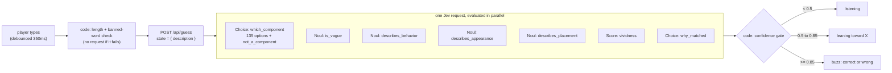

# Component Charades

A parlour game for design systems, refereed by [Jev](https://docs.typesafe.ai/introduction).

It's Taboo. You're dealt a UI component and you can see it; Jev can't. You describe it without using its name or any of its aliases, and as you type, Jev ranks every component in a 135-item library and puts a probability on each one. When its confidence crosses a threshold it buzzes in. Fewer words, better score. Ambiguity is the comedy: watching Toast, Snackbar, and Banner fight over the probability mass is the whole point.

A second mode, **Component Finder**, flips it around: describe a job in plain words ("submits a form", "nags me gently to save my work") and Jev tells you whether the library has a component for it, which one, how sure it is, and, if nothing fits, invites you to christen the component that does not exist yet.

Built in the spirit of [lostforwords.km.design](https://lostforwords.km.design/) and [rabbithole.km.design](https://rabbithole.km.design/): a text catalog, a natural-language intent, one ranking primitive, and the probabilities themselves used as the design material.

The visual register is the TypeSafe console: light grey ground, white cards with hairline borders and corner registration marks, a regular-weight grotesk (Geist) for headings, Geist Mono for labels and data, thin-line distributions, one holographic tile as the only flourish. This is deliberate beyond taste. The console draws each primitive as a schematic card (INSTRUCTIONS, OUTPUT, DISTRIBUTION), and this game is literally one Jev request, so the page is drawn the same way: the play panel is the `state` card, the odds board is the `choice · which_component` card with its distribution, confidence has its own readout, and the side Nouls appear as small instruments. Playing the game teaches the API.

There is no landing page. A card is dealt on load and everything fits a laptop viewport without scrolling. The `state` card's header shows your card by name ("Tree View · Jev can't see this") and the banned words ("get Jev to guess it without saying tree, file tree, hierarchy view…"), then your text, then Jev's commentary. The result card replaces it when the round ends. An earlier version hid the name and expected you to infer it from the banned list; that made people describe whatever they wanted and then not understand why the round was lost.

## Running it

```bash
npm install
cp .env.example .env.local   # then paste your TypeSafe key
npm run dev
```

Without a key (or with `JEV_MODE=fixtures`), the app runs against a keyword-overlap stand-in so you can work on the UI at zero spend. The footer marginalia reports `source: fixtures` so you can never mistake it for the model.

## Deploying

Live at [component-charades.southleft-llc.workers.dev](https://component-charades.southleft-llc.workers.dev).

Cloudflare Pages' Next.js adapter does not support Next 15+, so this uses the [OpenNext Cloudflare adapter](https://opennext.js.org/cloudflare) and deploys to a Worker with static assets. Wrangler needs Node 22+.

```bash
npm run preview                       # build and run the worker locally
npm run deploy                        # build and deploy
npx wrangler secret put TYPESAFE_API_KEY   # once, per environment
npx wrangler secret put ROUND_SECRET       # once; any random string (openssl rand -hex 32)
```

Config lives in `wrangler.jsonc` and `open-next.config.ts`. No R2 bucket is needed: the page is static and the API routes are dynamic, so there is nothing to cache incrementally.

## Why Jev, and not a chat model

Jev is a System One model. It does not generate text. It takes a `state` and a map of typed questions and returns typed answers with calibrated probabilities, all questions evaluated in parallel in one request. Three primitives only:

| Primitive | What it returns | Used here for |
| --- | --- | --- |
| Choice | one option from up to 255, plus the full distribution and a confidence | ranking the whole library; picking which aspect of the description gave the answer away |
| Score | a fractional position on 2–10 described levels, plus distribution and confidence | how vivid the writing is |
| Noul | probability that a yes/no statement is true | is it vague, does it mention behavior / looks / placement, does the library contain it at all |

This game is only viable because of those properties. A 136-option Choice over the library costs a fraction of a cent and returns in well under a second, so we can afford to re-ask on every debounced keystroke. Calibrated confidence makes the buzz-in honest: Jev buzzes when the distribution is peaked, not when a prompt told it to sound sure.

## Architecture



Code owns the workflow. Jev supplies numbers. Every rule that turns those numbers into game behavior lives in two files:

- [`src/lib/jev/questions.ts`](src/lib/jev/questions.ts): every question, every criterion, every threshold. This is the file to review.
- [`src/lib/game/verdict.ts`](src/lib/game/verdict.ts): turns an evaluation into `listening` / `leaning` / `buzzed` / `vague` / `not_a_component`, and detects toss-ups.

The rest:

| Path | Role |
| --- | --- |
| `src/data/components.json` | 135 components with `id`, `name`, `aliases` (the ban list), `category`, and a one-line `description` that becomes the Choice option's criteria |
| `src/lib/catalog.ts` | catalog lookups, banned-word derivation, the local banned-word check |
| `src/lib/jev/client.ts` | server-only `TypeSafeClient` singleton and cost math |
| `src/lib/jev/evaluate.ts` | calls Jev (or fixtures) and normalises the answers into an `Evaluation` |
| `src/lib/game/round.ts` | issues HMAC-signed round tokens so the client cannot forge a "correct" |
| `src/app/api/round/route.ts` | `POST` starts a round (returns token, category, ban list); `GET ?token=` reveals the answer when you fold |
| `src/app/api/guess/route.ts` | validates, re-checks banned words server-side, calls Jev, returns the trimmed ranking plus verdict |
| `src/hooks/useCharades.ts`, `src/hooks/useLostFound.ts` | debounce, abort in-flight requests, phase transitions, scoring |
| `src/components/*` | `Describer`, `OddsBoard`, `ConfidenceDial`, `RevealCard`, `Marginalia`, `Charades`, `LostFound`, `Stage` |

The API key never reaches the browser. All Jev calls happen in route handlers.

## Question design

A few decisions worth knowing about, all following the [How to build with TypeSafe](https://docs.typesafe.ai/concepts/how-to-build-with-system-one) guide and the [Jev 1.13 jaggedness](https://docs.typesafe.ai/model-jaggedness/jev-1.13) notes:

- **State is tiny.** The Charades state is `{ description }` and nothing else. Jev's accuracy drops as irrelevant state grows, and the library is already in the Choice criteria. Lost & Found adds a `library` array of names so the `exists_in_library` Noul has something to check against.
- **Every catalog entry is an option, with its description as the criterion.** Docs recommend giving the model the full list and adding an `other`-style escape; ours is `not_a_component`. Its probability is shown on the board as "not a component at all".
- **Speculative fan-out.** `describes_behavior`, `describes_appearance`, `describes_placement`, `vividness`, and `why_matched` are asked on every request even though they are only read at the end of a round. Adding them barely changes latency, and it saves a second request when the round ends.
- **Confidence is a second axis.** The `which_component` Choice's `confidence` decides whether Jev speaks at all. `LEANING = 0.5` and `BUZZ_IN = 0.85` are starting points, not truths; tune them against real rounds. Change criteria wording before touching thresholds.
- **Toss-ups come from the distribution, not a new question.** A runner-up with `p >= TOSS_UP (0.25)` becomes "For a moment it thought you meant Snackbar (31%)."
- **Code does the counting.** Word counts, banned-word matching, plural stemming, ranking, and scoring are all deterministic code. Jev is never asked to count or compare numbers.
- **Nouls and Choices are not interchangeable.** `exists_in_library` is a Noul because it is an absolute question ("does anything fit?") while `which_component` is relative ("which fits best?"). A Choice always puts its mass somewhere, so it cannot say "none of these", which is why the Finder needs both. This is the pattern from the [Line-by-line search cookbook](https://docs.typesafe.ai/cookbooks/semantic_find).
- **The two modes ask different Choice questions over the same options.** Charades describes a portrait ("which component is being described?"). The Finder describes a need, and with the same wording Jev drifted toward the *container* an action lives in: "submits a form" put 32% on Form, "closes the dialog" put 49% on Modal. Adding one sentence of focus to the Finder's instructions ("choose the element that performs the action, not the form or dialog around it") moved those to Button 99% and Button 94%. This is the literal-reading jaggedness in practice: the fix was wording, not a threshold.

## Observed cost and latency

Numbers from live runs against `jev-1.13.0` on 2026-09-21, 22 probe descriptions. The footer marginalia reports the same figures on every call.

| Mode | Questions per request | Input tokens | Cost per request | Latency (warm) |
| --- | --- | --- | --- | --- |
| Charades | 7 (one 136-option Choice, 4 Nouls, 1 Score, 1 four-option Choice) | ~5,490 | ~$0.00023 | 150–360 ms, first call ~700 ms |
| Lost & Found | 5 (adds the library listing to state) | ~6,010 | ~$0.00025 | 170–350 ms |

Pricing is $0.042 per million input tokens; output tokens are free. A full round of a dozen debounced requests costs about a quarter of a cent.

### Accuracy on casual descriptions

`npm run eval` (needs `TYPESAFE_API_KEY`; about a cent per run) sends 40 short, need-phrased descriptions written the way a designer types them, not the way the catalog reads ("little popup that says saved and goes away", "are you sure you want to delete this", "red dot with a 3 on the bell icon"), through both question sets and reports where the intended component ranked.

| Question set | Top-1 | Top-3 |
| --- | --- | --- |
| Charades (`which_component`) | 36 / 40 | 39 / 40 |
| Finder (`which_component`, need-focused) | 37 / 40 | 38 / 40 |

The misses are all defensible readings rather than nonsense: "agree to the terms" → Button over Checkbox; "pick one shipping speed" → Select over Radio Button; "turn dark mode on" → Theme Toggle over Switch (arguably the better answer); "switch between overview and reviews" → Segmented Control 0.52 vs Tabs 0.47, a genuine toss-up that the confidence value flags as one. The cases live in [`scripts/eval.ts`](scripts/eval.ts); add yours when you find a miss.

A note on reading results in Charades: if you describe something other than your card, Jev will match what you described and the round is scored as a card mismatch. The result card shows both panels, what Jev matched and what your card was, so the two are never confused.

### What the probe showed

- Sixteen deliberately confusable descriptions (Toast / Snackbar / Banner / Alert, Modal / Drawer / Popover / Tooltip, Checkbox / Radio / Switch, Skeleton / Spinner / Progress Bar, Combobox / Select) all ranked their target first at 99–100% probability. The one-line descriptions in `components.json` are doing the separating; no criteria tuning was needed.
- Two control inputs ("a thing on the screen", a soup recipe) put 95–98% on `not_a_component`, so the escape option works and the game refuses to guess at nonsense.
- The arc the game depends on is real. "a small message" gives Toast 80% / Snackbar 12% at confidence 0.79 (leaning); "a panel" is 48% Drawer at confidence 0.47 (vague); one more concrete detail tips either to a buzz. Jev is decisive once it has a behavior or a placement, which is why the score is word count: the skill is finding the one detail that ends the round.
- Lost & Found: "something that nags me gently to save my work" is found (exists 0.90, Autosave Indicator 96%). "three dots bubble when the other person is typing" is partial (exists 0.62, nearest Spinner 91%), which is the right call: the library has no typing indicator. "a spinning globe that tells me the weather" is absent (exists 0.22).
- `why_matched` leans heavily toward `behavior` whenever the description mentions any action. Treat it as flavour text rather than a measurement.

## Extending it

- Add a component: append to `src/data/components.json`. The Choice grows by one option; nothing else changes.
- Change the game's personality: edit the copy in `Charades.tsx` and `RevealCard.tsx`. The verdict logic is untouched.
- Add a difficulty setting: the `LEANING` / `BUZZ_IN` thresholds and `MIN_DESCRIPTION_CHARS` are the knobs.
- Pin a model: set `TYPESAFE_DEFAULT_MODEL=jev-1.13.0` in `.env.local` once thresholds are tuned, so an alias moving under you does not change the game.

The [TypeSafe agent skill](https://docs.typesafe.ai/agent-skill) is installed under `.agents/skills/typesafe-ai` (and symlinked from `.cursor/skills`) so a coding agent working in this repo has the API and patterns to hand.
